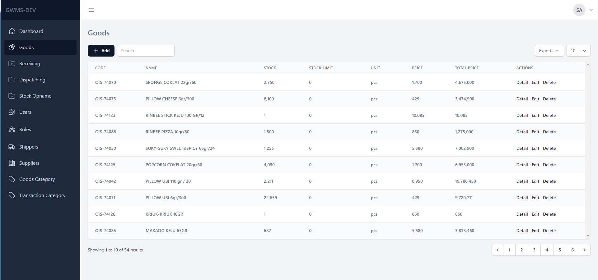

# Warehouse Management System
This is a web-based application for managing inventory and stock management in a small-scale warehouse environment. The application is built using PHP with Laravel framework, MySQL database, Tailwind CSS, and Laravel Livewire.

## Preview

## Features
The Warehouse Management System provides the following features:

- Dashboard: The dashboard provides an overview of the inventory status and stock management activities.
- Goods Management: The application allows adding, editing, and deleting goods in the inventory.
- Goods Stock History: The application keeps track of the stock history of the goods.
- User Management: The application provides user management capabilities, including user authentication and authorization.
- Export to CSV and PDF: The application allows exporting inventory data to CSV and PDF formats.
- Goods Dispatching: The application provides a mechanism to dispatch goods to customers or other warehouses.
- Goods Receiving: The application provides a mechanism to receive goods from suppliers or other warehouses.
- Stock Opname: The application allows taking a stock opname of the inventory to check for discrepancies.

## Installation
To install the application, follow the steps below:

- Clone the repository
- Install dependencies: `composer install`
- Create a new database and configure the `.env` file with the database credentials.
- Run database migrations: `php artisan migrate`
- Seed the database: `php artisan db:seed`
- Add super admin user: `php artisan db:seed --class=SuperAdminUserSeeder`
You can see the default username and password inside the seeder file
- Serve the application: `php artisan serve`

## Contributors
The Warehouse Management System is developed and maintained by:

- July Arifianto (@archrinto)

## License
The Warehouse Management System is open-source software licensed under the MIT license.
